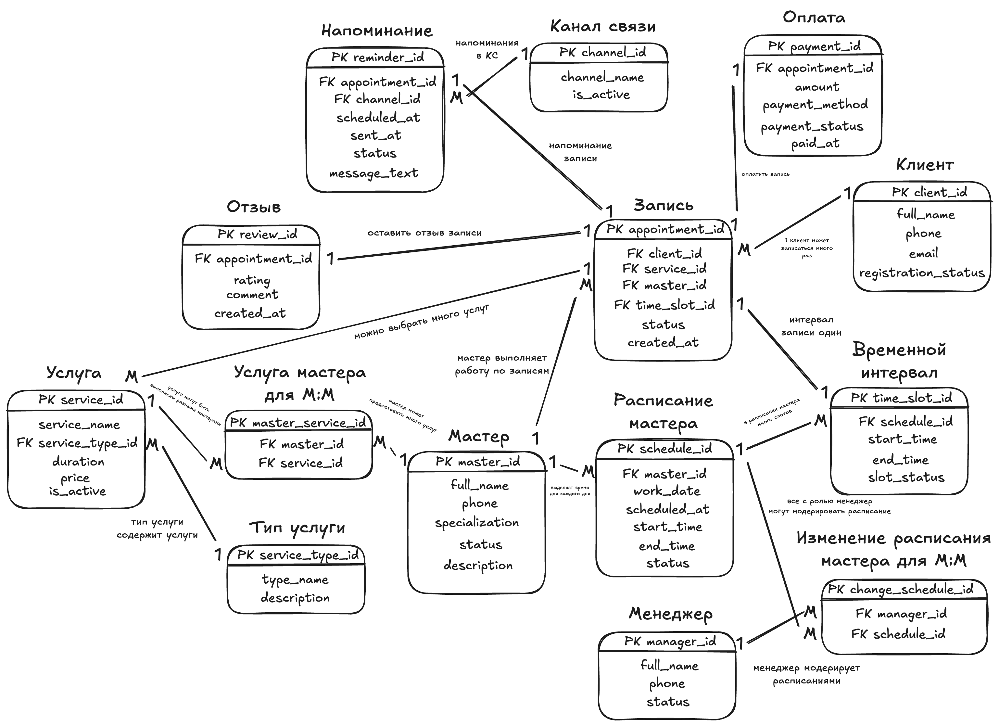
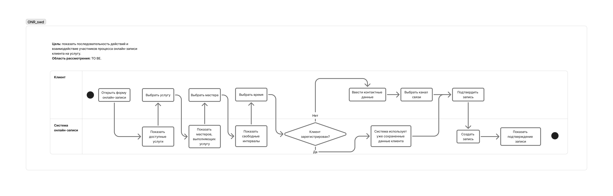
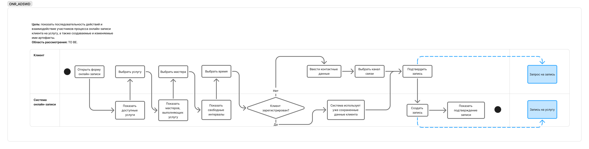
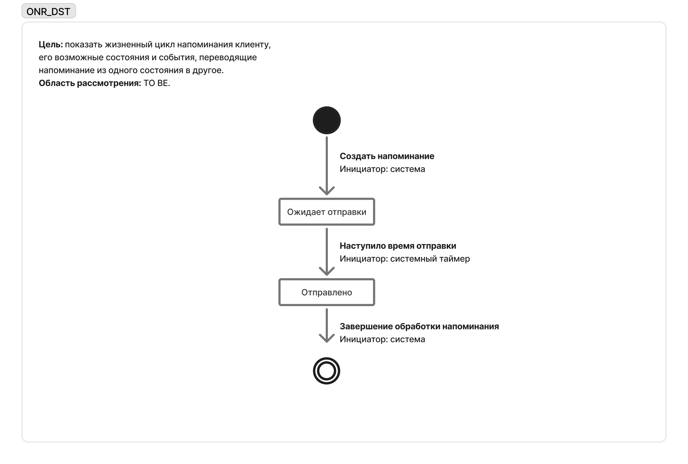

# Кейс «Барбершоп»

Кейс по бизнес- и системному анализу системы онлайн-записи в барбершоп.

Для идентификации артефактов проекта используется префикс `ONR` — Online Record.

## Артефакты проекта

| Код        | Артефакт                                                                                                              | Назначение                                                                                                                                          |
| ------------- | ----------------------------------------------------------------------------------------------------------------------------- | ------------------------------------------------------------------------------------------------------------------------------------------------------------- |
| `ONR_INF`   | [Каталог источников информации](src/ONR_INF.xlsx)                                                   | Систематизация источников для изучения предметной области и требований                         |
| `ONR_NDS`   | [Интересы, потребности и проблемы заинтересованных сторон](src/ONR_NDS.xlsx) | Анализ интересов, потребностей и проблем заинтересованных сторон                                     |
| `ONR_ASIS`  | [Модель текущего состояния](src/ONR_ASIS.xlsx)                                                          | Описание ролей, их действий и проблем в текущем состоянии процесса                                    |
| `ONR_TOBE`  | [Модель целевого состояния](src/ONR_TOBE.xlsx)                                                          | Описание изменений после внедрения системы и способов разрешения выявленных проблем |
| `ONR_STR`   | [Входные и выходные потоки данных](src/ONR_STR.xlsx)                                               | Фиксация информационного обмена между системой и внешними участниками                           |
| `ONR_ENT`   | [Каталог сущностей](src/ONR_ENT.xlsx)                                                                          | Выделение основных сущностей предметной области и их ключевых атрибутов                        |
| `ONR_CRUD`  | [CRUD-матрица](src/ONR_CRUD.xlsx)                                                                                       | Проверка полноты операций над сущностями и определение ответственных ролей                  |
| `ONR_DICT`  | [Словарь данных](src/ONR_DICT.xlsx)                                                                               | Формализация состава, типов и обязательности данных сущностей                                           |
| `ONR_MODEL` | [Логическая модель данных](diagrams/ONR_MODEL.png)                                                       | Представление сущностей, их атрибутов и взаимосвязей в виде ER-диаграммы                          |
| `ONR_GLS`   | [Глоссарий](src/ONR_GLS.xlsx)                                                                                         | Формирование единого понимания терминов и понятий предметной области                             |
| `ONR_DFD`   | [Data Flow Diagram](diagrams/ONR_DFD.png)                                                                                      | Диаграмма потоков данных уровня 0                                                                                                 |
| `ONR_SWD`   | [Swimlane Diagram](diagrams/ONR_SWD.jpg)                                                                                       | Swimlane, процесс онлайн-записи клиента на услугу                                                                           |
| `ONR_ADSWD` | [Extended Swimlane Diagram](diagrams/ONR_ADSWD.png)                                                                            | Swimlane с создаваемыми артефактами                                                                                                   |
| `ONR_DST`   | [State Diagram](diagrams/ONR_DST.png)                                                                                          | Жизненный цикл напоминания клиенту                                                                                             |

Для проектных артефактов используется формат:

`<PROJECT>_<ARTIFACT>`

где:

- `ONR` — Online Record, префикс проекта;
- `INF` — Information Sources, каталог источников информации;
- `NDS` — Needs, интересы, потребности и проблемы заинтересованных сторон;
- `ASIS` — As Is, описание текущего состояния;
- `TOBE` — To Be, описание целевого состояния;
- `STR` — Streams, входные и выходные потоки данных;
- `ENT` — Entities, каталог сущностей предметной области;
- `CRUD` — Create, Read, Update, Delete, матрица операций над сущностями;
- `DICT` — Data Dictionary, словарь данных;
- `MODEL` — Logical Data Model, логическая модель данных;
- `DFD` — Data Flow Diagram, диаграмма потоков данных;
- `SWD` — Swimlane Diagram, диаграмма «плавательные дорожки»;
- `ADSWD` — Artifact-Enhanced Swimlane Diagram, расширенная диаграмма «плавательные дорожки» с создаваемыми артефактами;
- `DST` — State Diagram, диаграмма состояний объекта;

- `GLS` — Glossary, глоссарий проекта.

Элементы каталогов имеют собственные уникальные идентификаторы.

## `ONR_INF` — каталог источников информации

[`ONR_INF.xlsx`](src/ONR_INF.xlsx) содержит источники, используемые для изучения предметной области и уточнения представления о будущей системе.

Для каждого источника фиксируются:

- уникальный идентификатор;
- наименование и ссылка;
- тип источника;
- приоритет изучения;
- актуальность;
- статус изучения;
- дата добавления;
- автор;
- примечания.

Каталог позволяет систематизировать исходную информацию и определять приоритет её изучения.

## `ONR_NDS` — интересы, потребности и проблемы заинтересованных сторон

[`ONR_NDS.xlsx`](src/ONR_NDS.xlsx) содержит результаты анализа заинтересованных сторон проекта с точки зрения их интересов, потребностей и существующих проблем.

Для каждой заинтересованной стороны фиксируются:

- уникальный идентификатор;
- наименование заинтересованной стороны;
- интересы по отношению к проекту и будущей системе;
- потребности, которые необходимо учитывать при дальнейшем анализе;
- проблемы, существующие в текущей ситуации.

Артефакт помогает определить, какие ожидания и проблемы различных заинтересованных сторон необходимо учитывать при формировании требований к системе.

## `ONR_ASIS` — модель текущего состояния

[`ONR_ASIS.xlsx`](src/ONR_ASIS.xlsx) описывает текущее состояние процессов до внедрения системы онлайн-записи.

В модели зафиксированы:

- роли заинтересованных сторон;
- выполняемые ими действия;
- существующие способы выполнения действий;
- проблемы, возникающие в текущих процессах.

Модель `As Is` помогает зафиксировать исходное состояние и определить проблемные области, которые необходимо учитывать при проектировании будущей системы.

## `ONR_TOBE` — модель целевого состояния

[`ONR_TOBE.xlsx`](src/ONR_TOBE.xlsx) описывает предполагаемое состояние процессов после внедрения системы онлайн-записи.

Для действий заинтересованных сторон отражены:

- текущее состояние `As Is`;
- предполагаемое состояние `To Be`;
- изменения в способах выполнения действий;
- влияние будущей системы на выявленные проблемы;
- предполагаемые способы их разрешения.

Сопоставление моделей `As Is` и `To Be` позволяет показать, какие изменения должна обеспечить система и какие проблемы текущего процесса она помогает устранить.

## `ONR_STR` — входные и выходные потоки данных

[`ONR_STR.xlsx`](src/ONR_STR.xlsx) содержит описание информационных потоков между системой онлайн-записи и внешними участниками.

В таблице фиксируются:

- источник данных;
- получатель данных;
- содержание передаваемой информации;
- направление информационного потока;
- примечания и выявленные расхождения при необходимости.

Артефакт используется для проверки взаимодействий системы с её окружением.

## `ONR_ENT` — каталог сущностей

[`ONR_ENT.xlsx`](src/ONR_ENT.xlsx) содержит основные сущности предметной области, с которыми работает система онлайн-записи.

Для каждой сущности фиксируются:

- уникальный идентификатор;
- наименование;
- назначение;
- основные атрибуты.

Выделение сущностей позволяет определить, какие объекты и данные должны быть представлены в системе, и служит основой для дальнейшего построения модели данных.

## `ONR_CRUD` — CRUD-матрица сущностей

[`ONR_CRUD.xlsx`](src/ONR_CRUD.xlsx) содержит результаты проверки полноты операций над выделенными сущностями.

Для каждой сущности рассматриваются операции:

- `C` — Create, создание;
- `R` — Read, чтение;
- `U` — Update, изменение;
- `D` — Delete, удаление.

Для операций также указываются роли заинтересованных сторон и соответствующие действия.

Если из имеющейся информации невозможно однозначно определить исполнителя или допустимость операции, фиксируется необходимость уточнения либо формулируется рабочая гипотеза.

В матрице используются идентификаторы сущностей из `ONR_ENT`, что позволяет сохранять единое обозначение объектов между связанными аналитическими артефактами.

## `ONR_DICT` — словарь данных

[`ONR_DICT.xlsx`](src/ONR_DICT.xlsx) содержит формализованное описание данных, используемых в модели системы онлайн-записи.

Для элементов словаря фиксируются:

- принадлежность к сущности;
- наименование;
- мнемоника;
- описание;
- тип данных;
- обязательность заполнения.

Словарь данных дополняет описание сущностей техническими характеристиками данных и обеспечивает единообразное понимание их структуры.

## `ONR_MODEL` — логическая модель данных

[`ONR_MODEL.png`](diagrams/ONR_MODEL.png) представляет логическую модель данных системы онлайн-записи в виде ER-диаграммы.

Модель включает:

- основные сущности предметной области;
- атрибуты сущностей;
- ключи;
- связи между сущностями;
- множественность связей;
- справочные сущности;
- связующие сущности для отношений `M:M`.

Связи между сущностями дополнительно описаны глаголами, отражающими их смысл в предметной области.

Логическая модель объединяет результаты предыдущих этапов анализа данных и показывает структуру и взаимосвязи информации, необходимой для работы системы.

## `ONR_GLS` — глоссарий проекта

[`ONR_GLS.xlsx`](src/ONR_GLS.xlsx) содержит основные термины и понятия предметной области системы онлайн-записи.

Для каждого понятия фиксируются:

- уникальный идентификатор;
- термин;
- определение;
- синонимы;
- источник определения;
- автор;
- дата добавления или актуализации;
- примечания.

Глоссарий используется для единообразного понимания терминов и актуализируется по мере развития проекта.

## Process and System Models

В рамках анализа системы онлайн-записи были разработаны модели,
описывающие систему с разных точек зрения: движение данных,
последовательность действий участников процесса, создаваемые артефакты
и жизненный цикл объектов системы.

---

## `ONR_DFD` — Data Flow Diagram

[`ONR_DFD.png`](diagrams/ONR_DFD.png) содержит диаграмму потоков данных проектируемой системы.

Диаграмма потоков данных уровня 0 описывает движение информации
в проектируемой системе онлайн-записи.

На диаграмме отражены:

- внешние сущности, взаимодействующие с системой;
- основные процессы обработки данных;
- хранилища данных;
- информационные потоки между процессами, хранилищами
  и внешними сущностями.

Область рассмотрения: **TO BE**.

Редактируемый исходник: [ONR_DFD.excalidraw](diagrams/ONR_DFD.excalidraw)

---

## `ONR_SWD` — Swimlane Diagram

[`ONR_SWD.jpg`](diagrams/ONR_SWD.jpg) содержит диаграмму процесса онлайн-записи клиента на услугу.

Диаграмма «плавательные дорожки» описывает процесс
онлайн-записи клиента на услугу.

Цель модели — показать последовательность действий
и взаимодействие клиента с системой онлайн-записи.

В процессе отражены:

- просмотр доступных услуг;
- выбор услуги;
- выбор мастера;
- выбор свободного временного интервала;
- проверка регистрации клиента;
- ввод контактных данных для незарегистрированного клиента;
- использование сохранённых данных зарегистрированного клиента;
- выбор канала связи;
- подтверждение и создание записи.

Область рассмотрения: **TO BE**.

Редактируемый исходник: [ONR_SWD.jam](diagrams/ONR_SWD.jam)

---

## `ONR_ADSWD` — Extended Swimlane Diagram

[`ONR_ADSWD.png`](diagrams/ONR_ADSWD.png) содержит расширенную диаграмму процесса онлайн-записи.

Расширенная диаграмма «плавательные дорожки» дополняет
модель процесса онлайн-записи создаваемыми в процессе артефактами.

В дополнение к последовательности действий на диаграмме показаны
значимые результаты выполнения отдельных шагов процесса:

- **Запрос на запись** — формируется после подтверждения записи клиентом;
- **Запись на услугу** — создаётся системой онлайн-записи.

Связи между действиями и создаваемыми артефактами
показаны отдельно от основного потока процесса.

Область рассмотрения: **TO BE**.

Редактируемый исходник: [ONR_ADSWD.jam](diagrams/ONR_ADSWD.jam)

---

## `ONR_DST` — State Diagram

[`ONR_DST.png`](diagrams/ONR_DST.png) содержит диаграмму состояний напоминания клиенту.

Диаграмма состояний описывает жизненный цикл объекта
**«Напоминание клиенту»**.

Модель показывает возможные состояния объекта и события,
переводящие его из одного состояния в другое.

Основной жизненный цикл:

`Создание напоминания → Ожидает отправки → Отправлено`

Для переходов также определены инициаторы событий.

Область рассмотрения: **TO BE**.

Редактируемый исходник: [ONR_DST.jam](diagrams/ONR_DST.jam)
